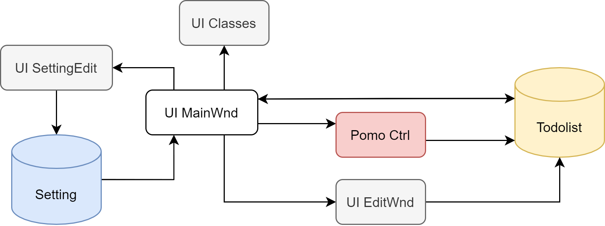

# Mastimer v1.1 重写计划

## 结构设计

## 功能链

### 主界面

- [ ] 开始番茄：UIC/UIMW 向 PomoCtl 发信号，PomoCtl 处理修改内部状态
- [ ] 提交番茄：UIC/UIMW 向 PomoCtl 发信号，PomoCtl 处理修改内部状态，调用 Todolist 接口修改
- [ ] 删除番茄：UIC/UIMW 向 PomoCtl 发信号，PomoCtl 处理修改内部状态
- [ ] 重排序：UIC/UIMW 调用 Todolist 接口
- [ ] 新增任务：UIC/UIMW 调用 TodoEditor 模块接口，若确认返回则调用 Todolist 接口
- [ ] 修改任务：UIC/UIMW 调用 TodoEditor 模块接口，若确认返回则调用 Todolist 接口
- [ ] 删除任务：UIC/UIMW 弹出对话框询问，若确认返回则调用 Todolist 接口
- [ ] 设置：UIC/UIMW 调用 SettingEditor 模块接口，若确认返回则修改 Setting，自动保存读取
- [ ] Timer：更新番茄状态：UIMW 从 PomoCtrl 读取数据
- [ ] 自动保存：任意造成修改的行为调用 Todolist 接口
- [ ] Timer：番茄完成提醒：UIC/UIMW 提供发消息接口，由 PomoCtl 调用
- [ ] Timer：休息完成提醒：UIC/UIMW 提供发消息接口，由 PomoCtl 调用

### 新建/编辑窗口

- [ ] 任务名称

- [ ] 已用番茄数

- [ ] 预计番茄数

- [ ] 重要度

- [ ] 紧迫度

- [ ] 专注指数

- [ ] 任务列表